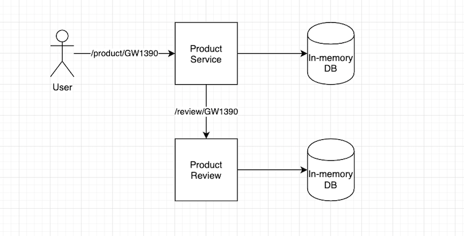

# Product Management - Java/Springboot

## Requirements
- Docker (for building and running container images)
- Java JDK11 & Maven (optional, in case you want to run or build the apps on your local machine)
&nbsp;

## Getting started
### Build
Builds container images for both apps
```bash
make build
```
### Run
Runs both apps via Docker-Compose
```bash
make run
```
### Test
Runs unit tests via Maven
```bash
make test
```
&nbsp;

## Architecture
This project contains 2 applications:
- Product Service
- Product Review

Users consume the Product Service endpoint `/products` to obtain product information along with product reviews information.
Product Service has a direct dependency on Product Review in order to return enriched data to the users.
In case that the Product Review is unavailable - this causes Product Service to return errors which impacts the user experience.
Both applications expose a healthcheck endpoint at `/actuator/health`.

<p align="center">
    
</p>
&nbsp;

## Interaction
### Product Service
```bash
# Get product by ID
curl http://localhost:8080/product/GW1390

# Healthcheck
curl http://localhost:8080/actuator/health
```
&nbsp;
### Product Review
```bash
# Get product review by ID
curl http://localhost:8081/review/GW1390

# Healthcheck
curl http://localhost:8081/actuator/health
```
&nbsp;
### Products available:
Here is a list of IDs that can be used on either app to obtain data:
 - GW1390
 - GZ5922
 - Q46222
 - GZ2228
 - EG4958

&nbsp;

## License and Software Information
 
© adidas AG
 
adidas AG publishes this software and accompanied documentation (if any) subject to the terms of the MIT license with the aim of helping the community with our tools and libraries which we think can be also useful for other people. You will find a copy of the MIT license in the root folder of this package. All rights not explicitly granted to you under the MIT license remain the sole and exclusive property of adidas AG.
 
NOTICE: The software has been designed solely for the purpose of demonstrating a hypothetical scenario in a simplified manner. The software is NOT designed, tested or verified for productive use whatsoever, nor or for any use related to high risk environments, such as health care, highly or fully autonomous driving, power plants, or other critical infrastructures or services.
 
If you want to contact adidas regarding the software, you can mail us at _software.engineering@adidas.com_.
 
For further information open the [adidas terms and conditions](https://github.com/adidas/adidas-contribution-guidelines/wiki/Terms-and-conditions) page.
